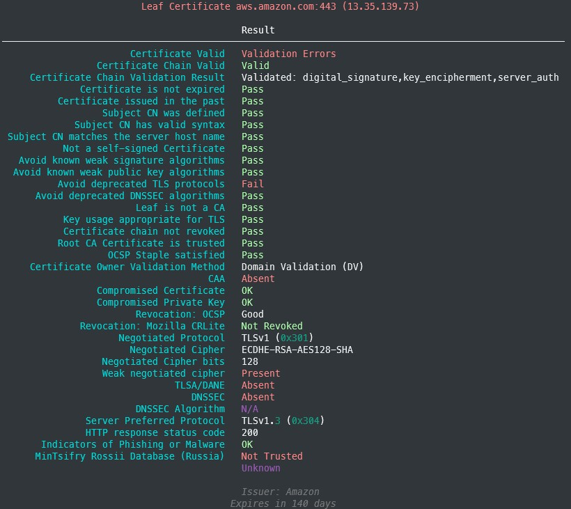
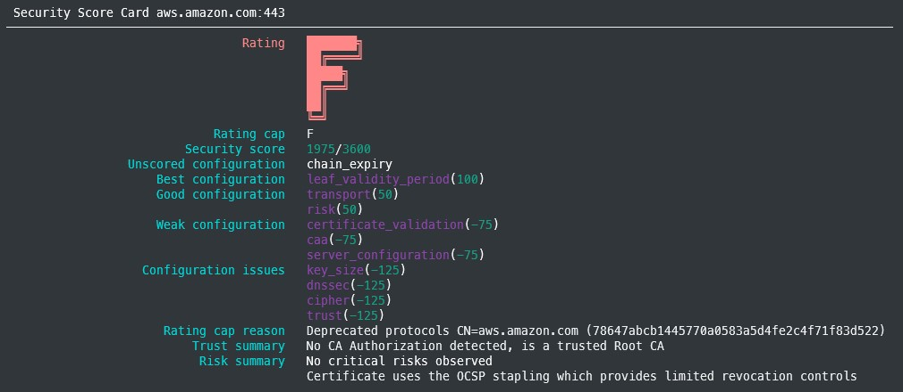

# Command Line

First get [pipx](https://packaging.python.org/key_projects/#pipx) for [better python command line tool installs](https://packaging.python.org/guides/installing-stand-alone-command-line-tools/)

Install python 3.9+

Then install `trivialscan` as a single command-line tool on your system:

```sh
pipx install trivialscan
```

The minimum requirement is python 3.8.

If you have multiple python executables installed, and the default enabled is not at least version 3.8 you might need to specify which one to use:

```sh
pipx install --python $(which python3) trivialscan
```

## Show CLI help

On the command-line:

```sh
trivial scan --help
```

produces:

```
usage: trivial scan [-h] [-c CAFILES] [-C CLIENT_PEM] [-t TMP_PATH_PREFIX]
                    [-p CONFIG_FILE] [-O JSON_FILE] [-q] [--disable-sni]
                    [--hide-banner] [--no-multiprocessing] [--track-changes]
                    [--last-json PREVIOUS_REPORT]
                    [targets ...]

Release 3.0.0-devel https://gitlab.com/trivialsec/trivialscan/-/tree/devel

positional arguments:
  targets               All unnamed arguments are hosts (and ports) targets to
                        test. ~$ trivial scan google.com:443 github.io
                        owasp.org:80

options:
  -h, --help
  -c CAFILES, --cafiles CAFILES
                        path to PEM encoded CA bundle file, url or file path
                        accepted
  -C CLIENT_PEM, --client-pem CLIENT_PEM
                        path to PEM encoded client certificate, url or file
                        path accepted
  -t TMP_PATH_PREFIX, --tmp-path-prefix TMP_PATH_PREFIX
                        local file path to use as a prefix when saving
                        temporary files such as those being fetched for client
                        authorization
  -p CONFIG_FILE, --config-path CONFIG_FILE
                        Provide the path to a configuration file
  -O JSON_FILE, --json-file JSON_FILE
                        Store to file as JSON
  -q, --hide-progress-bars
                        Hide task progress bars
  --disable-sni         Do not negotiate SNI using INDA encoded host
  --hide-banner
  --no-multiprocessing
  --track-changes
  --last-json PREVIOUS_REPORT
                        Stored JSON file to be used as baseline for --track-
                        changes (Defaults to value of --json-file)
  --version
  -a ACCOUNT_NAME, --account-name ACCOUNT_NAME
                        Your unique Trivial Security account name, used for
                        enhanced features.
  -v, --errors-only     set logging level to ERROR (default CRITICAL)
  -vv, --warning        set logging level to WARNING (default CRITICAL)
  -vvv, --info          set logging level to INFO (default CRITICAL)
  -vvvv, --debug        set logging level to DEBUG (default CRITICAL)
```

Just run `trivial scan <host name>`

Summary CLI output



Security Score Card



For full CLI output and JSON format please look in `examples/`

## Arguments

### -H --host

The domain name, or host name, to assess.

**Required**: `True`

**Default**: `None`

**Type**: `str`

**Validation**: rfc1035, rfc2181, rfc4343, rfc5890, rfc5892, rfc5893, and rfc7766. wildcards (rfc4592) not supported

**Examples**

1. `trivial scan -H google.com`
2. `trivial scan --host ssllabs.com`
3. `trivial scan --host www.google.com`
4. `trivial scan -H microsoft.com`

### -p --port

A port number for the TLS/HTTPS server corresponding to the specified host name.

**Required**: `False`

**Default**: `443`

**Type**: `int`

**Validation**: Type `int`

**Examples**

1. `trivial scan -H ssllabs.com -p 443`
2. `trivial scan -H tls-v1-0.badssl.com --port 1010`
3. `trivial scan -H tls-v1-1.badssl.com -p 1011`

### --disable-sni

By default SNI will be used, and SNI will be attempted. If you user, or wish to emulate, an older client without SNI use `--disable-sni` to skip the SNI step and assume non-SNI connections are refused

**Required**: `False`

**Default**: omitted

**Type**: no value, not applicable

**Validation**: no value, not applicable

**Examples**

1. `trivial scan -H wrong.host.ssllabs.com --sni`
2. `trivial scan -H google.com --sni`

### -c --cafiles

A path to the file, or a valid URL, that is a bundle of one or more PEM encoded certificates of additional Certificate Authorities (CA) you wish to trust during client context when verifying the server certificate

**Required**: `False`

**Default**: `None`

**Type**: `str`

**Validation**: Type `str`, valid path and file is readable, or valid url (see `--host` validation)

**Examples**

1. `trivial scan -H google.com -c /path/to/bundle.pem`
2. `trivial scan -H google.com --cafiles /path/to/bundle.pem`
3. `trivial scan -H google.com -c 'https://my.domain.com/uri/path/to/bundle.pem'`
4. `trivial scan -H google.com --cafiles 'https://my.domain.com/uri/path/to/bundle.pem'`

A path to the file, or a valid URL, to a PEM encoded certificate that should be sent to a server for Client Authentication

### -C --client-pem

**Required**: `True` when `--client-ca-pem` is used, otherwise `False`

**Default**: `None`

**Type**: `str`

**Validation**: Type `str`, valid path and file is readable, or valid url (see `--host` validation)

**Examples**

1. `trivial scan -H client.badssl.com -C /path/to/cert.pem`
2. `trivial scan -H client.badssl.com --client-pem /path/to/cert.pem`
3. `trivial scan -H client.badssl.com -C 'https://badssl.com/certs/badssl.com-client.pem'`
4. `trivial scan -H client-cert-missing.badssl.com --client-pem 'https://badssl.com/certs/badssl.com-client.pem'`

### -T --client-ca-pem

A path to the file, or a valid URL, to a **T**rusted PEM encoded Certificate Authority (CA) certificate that should be used to validate Client Authentication using server expected Client Certificate Authority (CA) subjects.

**Required**: `False`

**Default**: `None`

**Type**: `str`

**Validation**: Type `str`, valid path and file is readable, or valid url (see `--host` validation)

**Examples**

1. `trivial scan -H client.badssl.com -C /path/to/cert.pem -T /path/to/ca-cert.pem`
2. `trivial scan -H client.badssl.com --client-pem /path/to/cert.pem -T /path/to/ca-cert.pem`
3. `trivial scan -H client.badssl.com -C 'https://badssl.com/certs/badssl.com-client.pem' --client-ca-pem 'https://my.domain.com/uri/path/to/ca-cert.pem'`
4. `trivial scan -H client-cert-missing.badssl.com --client-pem 'https://badssl.com/certs/badssl.com-client.pem' --client-ca-pem 'https://my.domain.com/uri/path/to/ca-cert.pem'`

### -t --tmp-path-prefix

When using a URL for either `--client-ca-pem` or `--client-pem`, a certificate will be downloaded and stored temporarily on disk for the purposes of OpenSSL method calls. This optional argument allows you to specify a valid location for temporary storage that OpenSSL can read files from.

**Required**: `False`

**Default**: `/tmp`

**Type**: `str`

**Validation**: Type `str` and directory is readable

**Examples**

1. `trivial scan -H google.com -c 'https://my.domain.com/uri/path/to/bundle.pem' -t /path/to/temp`
2. `trivial scan -H google.com --cafiles 'https://my.domain.com/uri/path/to/bundle.pem' --tmp-path-prefix '/path/to/temp'`

### Controlling terminal output

**Default**: `CRITICAL`
By default, only the results will be output (stdout) and anything that prevents results from being displayed as output will be shown (stderr).
You can control how much additional (to results) information is shown using the pythonic and command-line logging methodology borrowed from (OpenSSH, Ansible, and others).
Simply add a `-v` for each level of verbosity desired:

- One `-v` (also available using `--errors-only`) will set `logging` level to `ERROR`
- Two `-vv` (also available using `--warning`) will set `logging` level to `WARNING`
- Three `-vvv` (also available using `--info`) will set `logging` level to `INFO`
- Four `-vvvv` (also available using `--debug`) will set `logging` level to `DEBUG`

There is no `-s` `-q` `--silent` `--quiet` because the entire purpose of this tool is to get an assessment

### Output formats

#### Text

**Default**: tab delimited text, each key/value pair separated by a line ending `\n`

#### More to come
